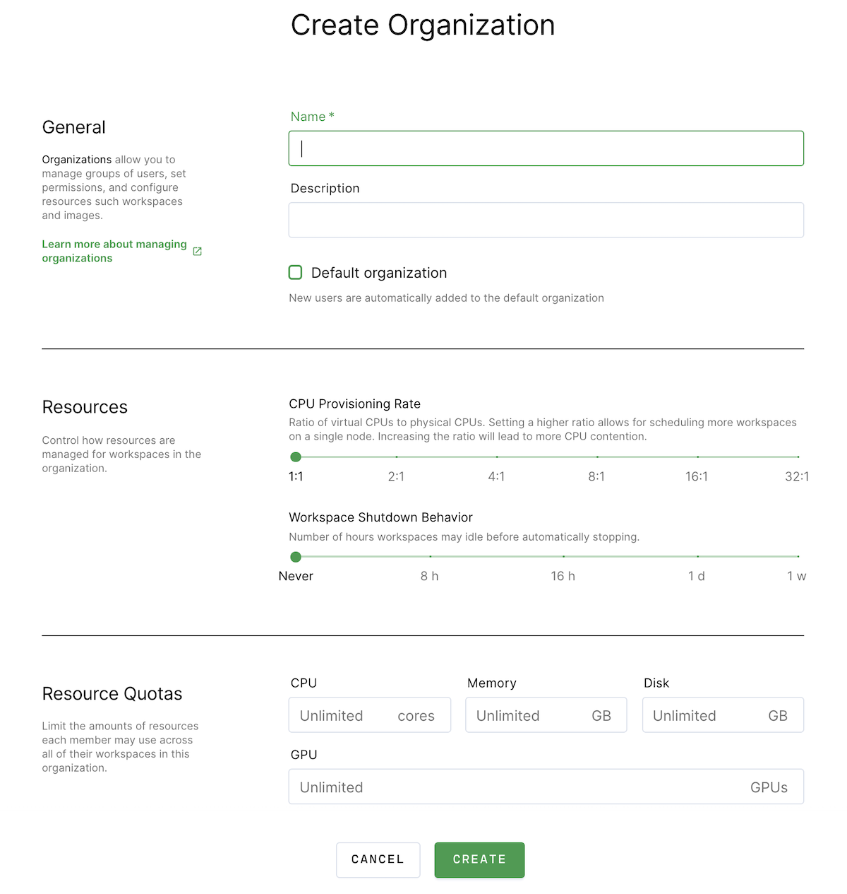

Organizations are groups that tie together users, workspaces, and images. You
must assign all of your images and workspaces to a specific organization. An
end-user can only access images that are assigned to the same organization they
are.

> Be sure to familiarize yourself with the [types of
> roles](access-control/organizations.md) you can assign users within an
> organization.

## The default organization

Coder automatically creates a default organization for you during the deployment
process. You can then assign users and their workspaces to that organization.

If you have multiple organizations, you can set one or more as the default; you
can also change which organizations are defaults at any time.

## Create a new organization

[Site admins and site managers](access-control/user-roles.md) can create new
organizations by going to **Manage** > **Organizations** > **New Organization**.

Provide a **name** and (optionally) a **description** for this organization. If
you want this to become a **Default organization**, make sure to check the
box for this.

You can also control how Coder manages resources for workspaces in this
organization. You can set the:

- **CPU Provisioning Rate**: sets the ratio of virtual CPUs to physical CPUs; if
  you set a higher ratio, you can schedule a larger number of workspaces per
  node, though it will also lead to greater CPU contention
- **Workspace Shutdown Behavior**: The number of hours a workspace may be idle
  before Coder stops it automatically to help free up resources

Finally, you can set **Resource Quotas**. These are limits on the number of
**CPUs** and **GPUs**, as well as the amount of **memory** and **disk space**,
each developer can request concurrently for running workspaces in this
organization.

When you've set your parameters, click **Create** to proceed.

## Editing an organization

You can edit an organization at any time by going to **Manage** >
**Organizations**.

Find the organization you want to edit, and click to open. In the top-right,
click **Edit** to launch the **Edit Organizations** dialog.

When you're finished making your changes, click **Update** to save.

## Namespaces

> **Deprecation notice**: The `namespaceWhitelist` field has been deprecated in
> [Coder version 1.17](../changelog/1.17.0.md).

Coder's Helm chart previously included a `namespaceWhitelist` field that
accepted a list of cluster namespaces and made them available to Coder. The
[workspace provider feature](workspace-providers/index.md) supersedes this
field.

You will not be able to make any changes _unless_ you are removing namespaces
that no longer contain workspaces with Coder deployments v1.17.0 or later (if
you remove namespaces from the `namespaceWhitelist` field, the workspaces in the
namespaces are no longer accessible).

For older Coder deployments, you can continue using existing workspaces in
whitelisted namespaces, though you cannot create new workspaces in those
namespaces.

If you want to separate Coder workspaces by namespaces in a Kubernetes cluster,
you can do so by [deploying a new workspace
provider](workspace-providers/deployment.md) to each additional namespace in
the cluster. The workspace provider provisions workspaces to the namespace it
has been deployed to, and you can control access to each workspace provider via
an organization allowlist to replace the previous organization namespace
behaviors.
